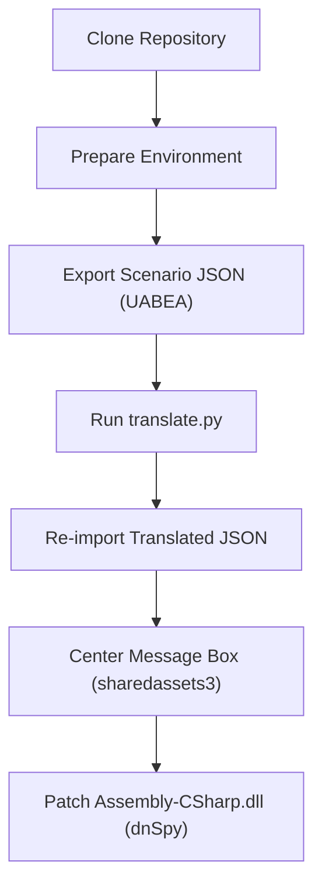

# **Bokuhime Project — Unofficial English Translation Patch**

> **DISCLAIMER**  
> *This patch is provided free of charge by fans, for fans, and is intended to be
> applied **only** to a legally-purchased copy of *Bokuhime Project* (Windows /
> Steam).  
> The authors are not affiliated with Nippon Ichi Software, Wizard Soft, or any
> of their subsidiaries. Do not redistribute game data.*  
> [License](../LICENSE)

---

## Table of Contents
1. [Features](#features)
2. [Requirements](#requirements)
3. [Quick-start (Patch Only)](#quick-start-patch-only)
4. [Full Translation Workflow](#full-translation-workflow)
5. [Project Diagram](#project-diagram)
6. [Technical Notes](#technical-notes)
7. [Credits](#credits)

---

## Features
|            |                                                    |
|------------|----------------------------------------------------|
| **100 % scenario text** | All story episodes **EP01 ➜ EP05**, side routes **OGA** & **BAD** endings |
| **Dynamic word-wrap**   | Extended to 70 characters per line, no mid-word breaks |
| **Centered message box**| Text box margin shifted left for better readability |
| **Safe emoji / tag handling** | Sprite, color, and line-height tags preserved |

---

## Quick-start (Patch Only)

1. **Download the patch**  
   Get the latest **Release ZIP** from GitHub (or under [`Patch`](./Patch/) folder):  
   https://github.com/BenjaminDanker/Translations/bokuhime/releases

2. **Locate your game folder**  
   Usually `C:\Program Files\Steam\steamapps\common\Bokuhime Project` 

3. **Overwrite three files**  
   - `Assembly-CSharp.dll` → `bokuhime_Data\Managed\`
   - `sharedassets3.assets` → `bokuhime_Data\`  
   - `luascript_assets_all_*.bundle` → `bokuhime_Data\StreamingAssets\aa\Windows\StandaloneWindows64\luascript_assets_all_*.bundle`  

4. **Launch the game**  
   Enjoy the full English patch with centered text and clean word-wrap!  

---

## Full Translation Workflow <a id="full-translation-workflow"></a>

### Requirements
| Tool | Version (tested) | Purpose |
|------|------------------|---------|
| **Python** | 3.11.9 | runs `translate.py` |
| **OpenAI account** | any | supplies API key for machine translation |
| **UABEA-CLI / GUI** | 0.5.6 “eight” release | edit Unity assets & bundles |
| **dnSpy** | 6.1.8 | patch `Assembly-CSharp.dll` |
| **git** (optional) | latest | clone this repository |

> **Running UABEA**  
> UABEA requires .NET 6 desktop runtime on Windows 10/11.  
> If the GUI fails to start, install [.NET 6 Desktop Runtime x64](https://dotnet.microsoft.com/download/dotnet/6.0).

### Usage
```bash
python translate.py {game} all
python translate.py {game} {filename}
python translate.py
```

### 1.  Clone the repository

```bash
git clone https://github.com/Translations.git
```

### 2.  Prepare environment

```bash
python -m venv venv
venv\Scripts\activate
pip install -r requirements.txt
```

Create a **`.env`** file in the root of the repo:

```
OPENAI_API_KEY=your_key_here
```

### 3.  Export scenario JSON

1. **UABEA → File → Open →**  
   `Bokuhime Project/bokuhime_Data/StreamingAssets/aa/StandaloneWindows64/luascript_assets_all_*.bundle`
2. **Info → Sort by Name column**  
   Select `EP_BAD_*`, `EP_OGA_*`, and `EP01_*` through `EP05_*`.  
   (Tip: **Shift + left click** `EP_BAD_01` then `EP05_22`. **Ctrl + left click** to unselect single files.)
3. **Export → Dump →** save into **`Export/`** inside the repo.  

### 4.  Run the translator

```bash
python translate.py      # choose option 2 = “process all files (async)”
```

*The script gets the text inside each `MSG([[ … ]])` block, concatenates them, then calls **GPT-4.1-mini** by
default, and rewrites the JSON in `Translated/`.*

> **Changing the model**  
> change EXPORT_DIR and TRANSL_DIR to your game directory  
> Edit `game.py`, change `model="gpt-4.1-mini"` to e.g. `"gpt-4o-mini"`, `"gpt-3.5-turbo-0125"`, or `gpt-4.1-nano`.  
> Anything with **8 k context** or higher will handle a whole episode at once.  

### 5.  Re-import translated JSON

1. **UABEA →** reopen the same `luascript_assets_all_*.bundle`.
2. **Import → From Folder →** select **`Translated/`**.  
   UABEA queues the replacements.
3. **File → Save** → choose **“Save modified bundle”**. If you get an error, look for the files with no asterisk * in them, go to the json file and remove any doubles quotes inside MSG blocks. (VSCode Tip: Alt + Z to toggle wrapping)

### 6.  Center the message box (sharedassets3)

1. **UABEA → File → Open →** `boku­hime_Data/sharedassets3.assets`
2. **Sort by Path ID → ID 2002 → Edit**  
   `m_margin → Vector4 → x = -200`  
   OK → **File → Save** (modified assets).

### 7.  Patch the Word-wrap routine

1. **dnSpy → File → Open →** `boku­hime_Data/Managed/Assembly-CSharp.dll`
2. Navigate **Wyvern → TextRender → WordWrap()**  
   Right-click → **Edit Method (C#)**.
3. Replace the body with **[WordWrap.cs](./WordWrap.cs)** from this repo  
   (contains 70-char limit + no mid-word split).
4. **Compile → File → Save All… → OK** (default flags are fine).

---

## Project Diagram

Below is a visual overview of the full translation workflow:



---

## Technical Notes <a id="technical-notes"></a>

| File | Why we patch it |
|------|-----------------|
| `sharedassets3.assets` | `TextMeshPro` margin X from `0` → `-200` centers text and leaves room for longer English lines. |
| `luascript_assets_all_…bundle` | Contains every scenario Lua table. The script extracts each `MSG()` inner text, joins together, translates, then reinserts. All emojis / sprite tags (`<sprite name="heart">`) survive. |
| `Assembly-CSharp.dll` | `Wyvern.TextRender.WordWrap` raised the per-line cap from **30 → 70** chars and adds a rewind loop to wrap at the nearest space so English words aren’t split. |

---

## Credits
| Role | Name / Handle |
|------|---------------|
| Lead script & tooling | **BenjaminDanker** |
| UABEA (Unity Asset Bundle Extractor) | **nesrak1** |
| dnSpy decompiler | **0xd4d** & contributors |
| Machine translation API | **OpenAI GPT-4.1** |
| Original game | © Wizard Soft / Nippon Ichi Software |

---

*Enjoy *Bokuhime Project* in English!  Pull requests are welcome for typo
fixes, glossary improvements, or automation scripts.*
